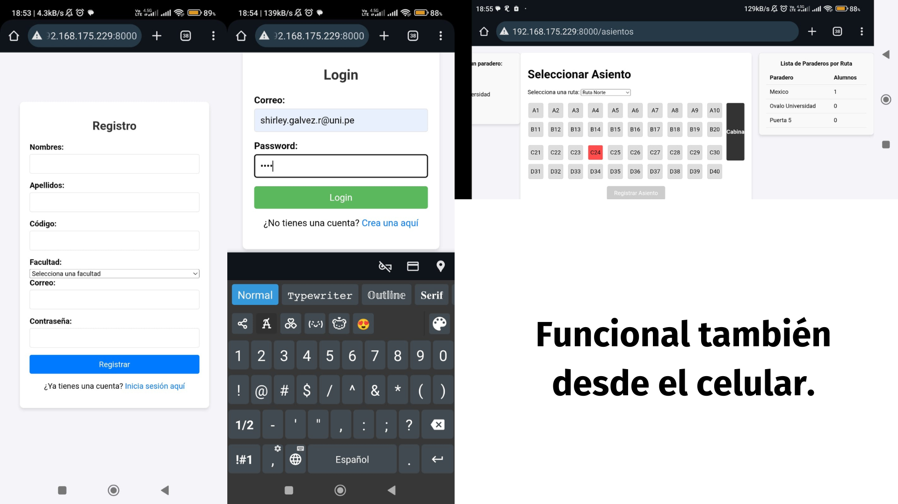
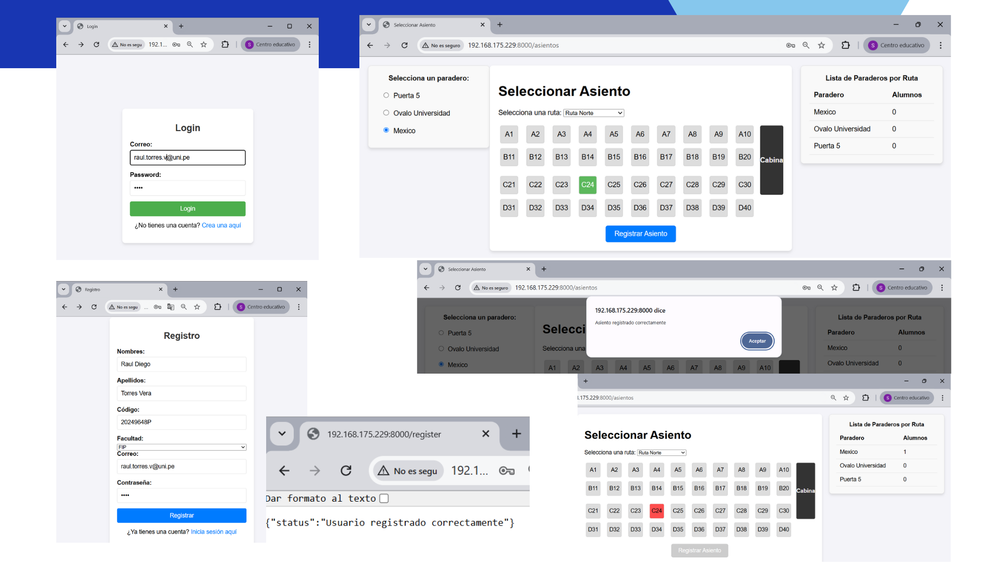

# Ubica Tu Bus 🚍📲

Sistema automatizado para la **reserva de asientos** del transporte interno de la UNI.

## Descripción

**Ubica Tu Bus** es una solución tecnológica diseñada para estudiantes de la Universidad Nacional de Ingeniería que buscan evitar las colas presenciales para acceder a un asiento. El sistema permite:

- Reservar un asiento desde el celular o web.
- Validar automáticamente la identidad del estudiante.
- Optimizar el uso de los cupos disponibles por ruta.

## Tecnologías utilizadas

- ⚙️ **Backend**: FastAPI  
- 🎨 **Frontend**: Jinja2  
- 🗄️ **Base de datos**: PostgreSQL (en contenedor Docker)  
- 🔐 **Autenticación**: Keycloak  
- 🐋 **Docker**: Para despliegue de contenedores

## Uso

- Create una cuenta ().
- Ingresa solo con tus credenciales (correo y contraseña).
- Reserva un asiento disponible por ruta y opcionalmente el paradero de destino.
- Listo, no necesitas colocar tus datos para reservar un asiento ya que accedes directamente con tu cuenta.

## Integrantes

- Galvez Rodriguez, Shirley Maciel
- Castro Mamani, Richard
- Miranda Dextre, Ivan Alviery
- Matias Echenique, Diego Franz

Docente: WASHINGTON ERNESTO LOAYZA MEJÍA  
Curso: Ingeniería de Software – CIB02 O  
Facultad de Ingeniería Eléctrica y Electrónica – UNI

## Capturas 📷
### Acceso desde el celular

### Acceso desde el navegador web

## Contribuciones

Este proyecto es parte de un trabajo académico. No se aceptan contribuciones externas por ahora.

## Licencia

Este proyecto es solo para fines académicos. Para uso comercial, contactar previamente.
